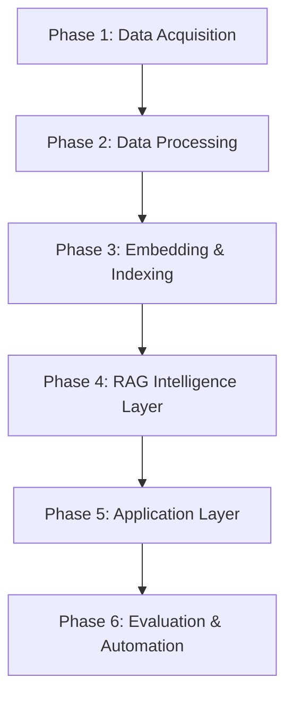

# 🏗️ INDMoney Mutual Fund FAQ RAG – System Architecture

This document defines the **complete architecture for building a facts-only Retrieval Augmented Generation (RAG) assistant** that answers questions about selected **SBI Mutual Fund schemes**.

The system is designed for **financial compliance**, meaning the assistant must:

* Provide **factual information only**
* Avoid **investment advice**
* Avoid **fund comparisons**
* Avoid **future return predictions**
* Provide **source citations**
* Use **official data sources**

The system uses **Retrieval Augmented Generation (RAG)** with the **Groq LLM** to ensure that all responses are grounded in **verified documents from trusted financial sources**. The chatbot must not answer using its own knowledge; it must respond **only** using information retrieved from stored embeddings.

## 📝 Operating Constraints

All generated responses must satisfy the following constraints:

1. Answers must be **maximum three sentences**.
2. Each response **must** include the line: `Last updated from sources:` followed by the relevant **source link**.
3. If information is not found in the embeddings, the assistant must politely inform the user that the information is not available.
4. **No Performance Claims:** The chatbot must not make performance claims or compute/compare fund returns. If asked about performance, it must provide a link to the official factsheet.

### 🛡️ Guardrails & Refusals

*   **Identity & PII:** The chatbot must not accept or process any personal information (PAN numbers, Aadhaar numbers, bank account numbers, OTPs, email addresses, phone numbers).
*   **Advisory Refusal:** Refuse opinion-based or portfolio-related questions (e.g., “Should I buy or sell this fund?”) with a polite, facts-only response and a relevant educational link.
*   **Investment Advice:** Strictly refuse any direct investment or financial advice.

---

# 📊 Schemes Covered

The knowledge base is limited to **five SBI Mutual Fund schemes**.

### 1. SBI Bluechip Fund — Large Cap Fund
- **Focus:** Well-established companies with high market capitalization.
- **Reference:** [INDMoney Link](https://www.indmoney.com/mutual-funds/sbi-bluechip-fund-direct-growth-3046)
- **Key Data:** Expense ratio, benchmark index, exit load, investment objective, portfolio allocation, risk category, minimum SIP.

### 2. SBI Flexicap Fund — Flexi Cap Fund
- **Focus:** Dynamic investment across Large, Mid, and Small cap companies.
- **Reference:** [INDMoney Link](https://www.indmoney.com/mutual-funds/sbi-flexicap-fund-direct-growth-3249)

### 3. SBI Long Term Equity Fund — ELSS Tax Saving Fund
- **Focus:** Tax deductions under Section 80C; mandatory **3-year lock-in**.
- **Reference:** [INDMoney Link](https://www.indmoney.com/mutual-funds/sbi-long-term-equity-fund-direct-growth-2754)

### 4. SBI Small Cap Fund — Small Cap Fund
- **Focus:** Companies ranked below top 250; **Very High Risk** category.
- **Reference:** [INDMoney Link](https://www.indmoney.com/mutual-funds/sbi-small-cap-fund-direct-plan-growth-3603)

### 5. SBI Midcap Fund — Mid Cap Fund
- **Focus:** Companies ranked 101-250; benchmarked against **Nifty Midcap 150 TRI**.
- **Reference:** [INDMoney Link](https://www.indmoney.com/mutual-funds/sbi-midcap-fund-direct-growth-3129)

---

# 🧠 System Phases

## 🚀 Phase 1 — Data Acquisition
**Objective:** Collect authoritative data sources (Factsheets, SID, KIM).
- **Sources:** `sbimf.com`, `sebi.gov.in`, `amfiindia.com`.
- **Tools:** Playwright, BeautifulSoup, PyMuPDF.
- **Output:** `/data/raw/*.md`
- **Test Case:** Domain whitelist check; successful extraction of expense ratios/exit loads.

## 🚀 Phase 2 — Data Processing & Chunking
**Objective:** Create structured knowledge chunks (400-700 tokens).
- **Metadata:** `fund_name`, `source_url`, `document_type`, `section`, `last_updated`.
- **Output:** `/data/processed/`
- **Test Case:** Semantic integrity of chunks (e.g., benchmark info is not split).

## 🚀 Phase 3 — Embedding & Indexing
**Objective:** Build the hybrid retrieval system.
- **Vector DB:** ChromaDB.
- **Model:** `text-embedding-3-small`.
- **Search Type:** Hybrid (Semantic Vector + BM25 Keyword).
- **Test Case:** Retrieval of correct fund chunk for queries like "ELSS lock-in" or "Midcap benchmark".

## 🚀 Phase 4 — RAG Intelligence Layer
**Objective:** Build the reasoning pipeline with guardrails.
- **Logic:** Intent Classification → Retrieval → Context Injection → Generation → Citation Validation.
- **Test Case:** Verify refusal of "Which fund should I invest in?".

## 🚀 Phase 5 — Application Layer
**Objective:** Web interface development.
- **Backend:** FastAPI (`/ask`, `/health`).
- **Frontend:** Streamlit with "INDMoney" premium aesthetics.
- **UI Elements:** 
    - A welcome message.
    - Three example questions for guidance.
    - A clear note stating: “Facts-only. No investment advice.”
- **Test Case:** End-to-End flow: User Question → 3-sentence cited answer.

## 🚀 Phase 6 — Evaluation & Automation
**Objective:** Long-term reliability and maintenance.
- **Automation:** GitHub Actions for weekly scraper & index refresh.
- **Test Case:** Successful atomic swap of vector index.

---

# 🛡️ Compliance Summary

| Rule                  | Implementation      |
| --------------------- | ------------------- |
| No investment advice  | Intent classifier   |
| Official sources only | Domain whitelist    |
| Privacy protection    | PII regex scrubber  |
| Factual grounding     | Context-only RAG    |
| No comparisons        | Prompt restrictions |
