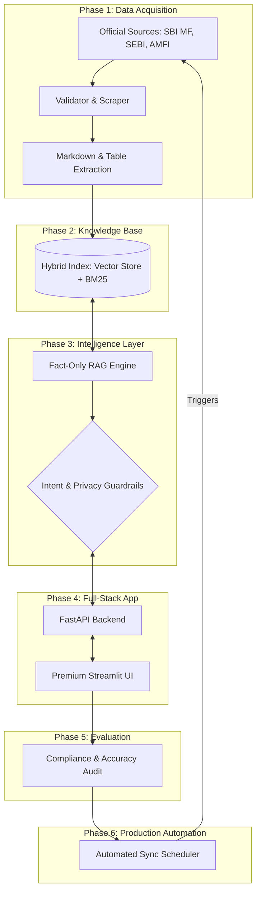

# 🏗️ Architecture Design: INDMoney Mutual Fund FAQ RAG

This document outlines the multi-phase architecture for a compliance-first, facts-only Retrieval Augmented Generation (RAG) assistant for SBI Mutual Fund schemes.

## 📌 Architecture Overview

---

## 🚀 Phase-wise Implementation Detail

### Phase 1: Data Acquisition (The Foundation)
- **Objective:** Collect high-fidelity data from official sources only.
- **Tech:** Python, Playwright/BeautifulSoup, PyMuPDF (for factsheet parsing).
- **Constraints:**
    - Strictly whitelist-only: `sbimf.com`, `sebi.gov.in`, `amfiindia.com`.
    - Extract tabular data (Expense Ratio, Exit Load) into structured markdown to preserve context.
    - No third-party blogs or unofficial data.

### Phase 2: Knowledge Base (Search & Retrieval)
- **Objective:** Enable precise factual retrieval for semantic and keyword queries.
- **Tech:** ChromaDB (Vector Store), OpenAI `text-embedding-3-small`.
- **Retrieval Strategy:** 
    - **Hybrid Search:** Combine Vector similarity (for meaning like "lock-in") with BM25 (for entities like "SBI Midcap Fund").
    - **Metadata:** Store `source_url`, `fund_name`, and `last_updated_timestamp` with every chunk.

### Phase 3: Intelligence Layer (Reasoning & Guardrails)
- **Objective:** Enforce compliance and factual accuracy with **Groq LLM**.
- **Components:**
    - **Grounding:** Chatbot must not answer using its own knowledge; must respond **only** using retrieve context. If not found, inform the user that it's unavailable.
    - **Refusal Engine:** Detect and decline queries asking for "Best fund", "Returns projections", or "Investment advice". Redirect to SEBI/AMFI educational links.
    - **Fund Returns:** No performance claims or return computations/comparisons. Provide factsheet link instead.
    - **PII Scrubber:** Strictly refuse processing of PAN, Aadhaar, Bank Accounts, OTPs, Email, or Phone Numbers.
    - **System Prompt:** Strict instructions for 3-sentence answers and citation format: "Last updated from sources: [Source Link]".

### Phase 4: Full-Stack App (User Experience)
- **Objective:** Provide a premium, responsive interface.
- **Backend:** FastAPI for asynchronous LLM streaming and state management.
- **Frontend:** Streamlit with custom CSS to match INDMoney's aesthetic.
- **Features:** 
    - Welcome message: "Welcome to the SBI Mutual Fund Assistant. I can help you with factual information about our schemes."
    - Clear note: "Facts-only. No investment advice."
    - Three interactive example questions for common queries.

### Phase 5: Evaluation (Quality Assurance)
- **Objective:** Validate the system against business rules.
- **Tests:**
    - **Red-Teaming:** Force the model to give advice or return projections.
    - **Factual Verification:** Ground truth comparison against the latest SBI MF factsheets.
    - **Link Check:** Ensure every response contains a valid, working official link.

### Phase 6: Production Automation (Maintenance)
- **Objective:** Keep the knowledge base indefinitely fresh.
- **Tech:** GitHub Actions or `APScheduler`.
- **Workflow:**
    1. Weekly trigger to re-scrape sources.
    2. Check for hash differences in data.
    3. Re-index and perform "Atomic Swap" of the database to ensure zero downtime.
    4. Health alerts if official website structures change.

---

## 🛡️ Compliance & Privacy Check
| Rule | Implementation |
| :--- | :--- |
| **No Investment Advice** | Intent Classifier + Refusal Response Template. |
| **Official Sources Only** | Scraper Restricted to Whitelisted Domains. |
| **Privacy (PII)** | Local Regex-based Scrubber + Session Statelessness. |
| **Factual Consistency** | Context Window restricted ONLY to retrieved documents. |
| **No Comparisons** | Prompt-level prohibition of cross-fund performance analysis. |
