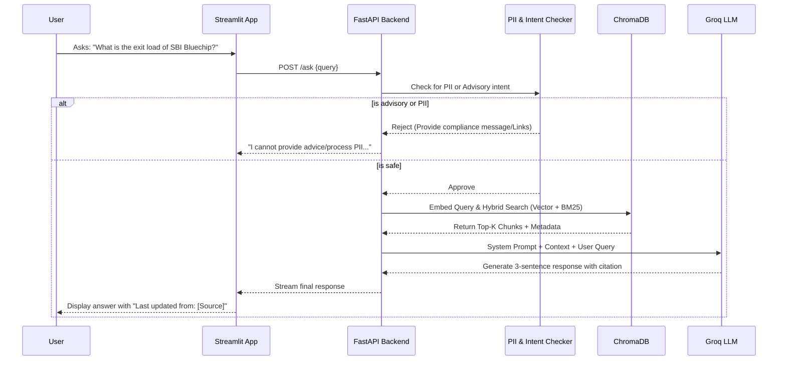

# 🏗️ INDMoney Mutual Fund FAQ RAG – Comprehensive Architecture & Design

This document serves as the **master architecture and technical design specification** for the facts-only Retrieval Augmented Generation (RAG) assistant focused on SBI Mutual Fund schemes. It consolidates system architecture, operational flows, data pipelines, and constraint mechanisms into a single source of truth.

---

## 1. 📌 System Overview & Operating Constraints

The chatbot is designed to handle queries for retail investors specifically limited to selected SBI Mutual Funds. Being a financial application, it must strictly adhere to regulatory compliance and factual accuracy. 

### System Guardrails
- **Facts-Only:** Must respond only using information retrieved from the specific document embeddings. No hallucination or usage of intrinsic LLM knowledge.
- **No Financial Advice:** Rejects queries regarding buy/sell recommendations, portfolio building, and predictive fund returns.
- **Maximum 3 Sentences:** Answers must be concise.
- **Mandatory Attribution:** Every response must end with `Last updated from sources: [Link]`.
- **Privacy Protection (PII):** Must reject/scrub queries containing PAN, Aadhaar, bank accounts, or similar sensitive information.
- **No Cross-Fund Comparisons:** Restricts the LLM from comparing one fund's performance against another.

### Supported Schemes
The knowledge base is restricted to official factsheets, Scheme Information Documents (SID), and Key Information Memorandums (KIM) for:
1. **SBI Bluechip Fund** (Large Cap)
2. **SBI Flexicap Fund** (Flexi Cap)
3. **SBI Long Term Equity Fund** (ELSS Tax Saving - 3 yr Lock-in)
4. **SBI Small Cap Fund** (Small Cap)
5. **SBI Midcap Fund** (Mid Cap)

---

## 2. 📊 High-Level Service Architecture

---

## 3. 🔄 Core System Flows

### A. The RAG Query Sequence Flow
The following sequence diagram details exactly what happens when a user submits a query on the platform.

### B. The Automated Data pipeline (ETL) Flow

---

## 4. 🚀 Phase-by-Phase Technical Implementation

### Phase 1: Data Acquisition
- **Tools:** Playwright/BeautifulSoup for web scraping, PyMuPDF for handling tabular data inside Mutual Fund PDFs.
- **Constraint:** Domain Whitelist enforcement (`sbimf.com`, `sebi.gov.in`, `amfiindia.com`). Any link not conforming is rejected.

### Phase 2: Processing & Chunking
- **Chunk Size:** Configured to ~400-700 tokens to ensure semantic boundaries are maintained, especially keeping related tabular data (like risk metrics) intact.
- **Metadata Structure:** Extremely critical for RAG filtering. Includes `fund_name`, `source_url`, `document_type`, `section`, `last_updated_timestamp`.

### Phase 3: Embedding & Indexing
- **Engine:** ChromaDB local vector storage (optimized for stateless deployment).
- **Strategy:** Hybrid Search. It uses vector similarity for resolving semantic intent (e.g., "what is the minimum I can invest" matches "Minimum SIP Amount") and BM25 (keyword matching) for exact entities (e.g., "SBI Flexicap Fund").

### Phase 4: Intelligence & Generation (Guardrails)
- **Model Engine:** Groq API (delivering ultra-low latency inference).
- **Core Prompt Strategy:** Grounding forces the LLM to reply "The provided document does not contain this information" if the vector search returns irrelevant chunks. 

### Phase 5 & 6: Application Layer & Deployment Architecture
- **Web App:** Built on Streamlit to mimic a sleek, premium INDMoney interface.
- **Backend:** FastAPI handles async requests, enabling high throughput.
- **Hosting (Vercel Core Pattern):** Optimized to run within 500MB serverless constraints utilizing external API bridges for heavy processing (HuggingFace for Embeddings, Groq for Generation). 

---

## 5. 🛠️ Technology Stack

| Layer | Technology Used | Purpose |
| :--- | :--- | :--- |
| **Frontend** | Streamlit, HTML/CSS | UI delivery, User interactions |
| **Backend API** | FastAPI, Python 3.12+ | Orchestration, HTTP server |
| **LLM Provider** | Groq API | High-speed response generation |
| **Embeddings** | HuggingFace Inference API | Vector conversion within Vercel memory limits |
| **Vector DB** | ChromaDB | Document chunk storage & retrieval |
| **Scraping** | Playwright, BeautifulSoup, PyMuPDF | Initial data gathering |
| **Deployment** | Vercel (Serverless) | Cloud hosting |

## Conclusion
This architecture guarantees a **secure, un-biased, and fact-driven advisory assistant** completely contained within official documentation, fulfilling the strict regulatory constraints of the Indian mutual fund distributing space.
